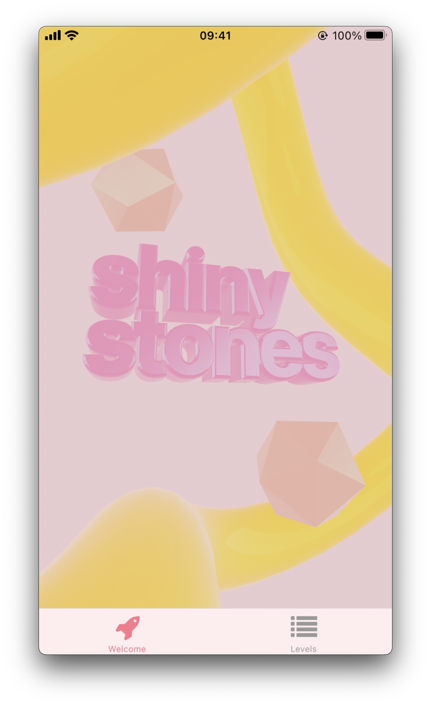
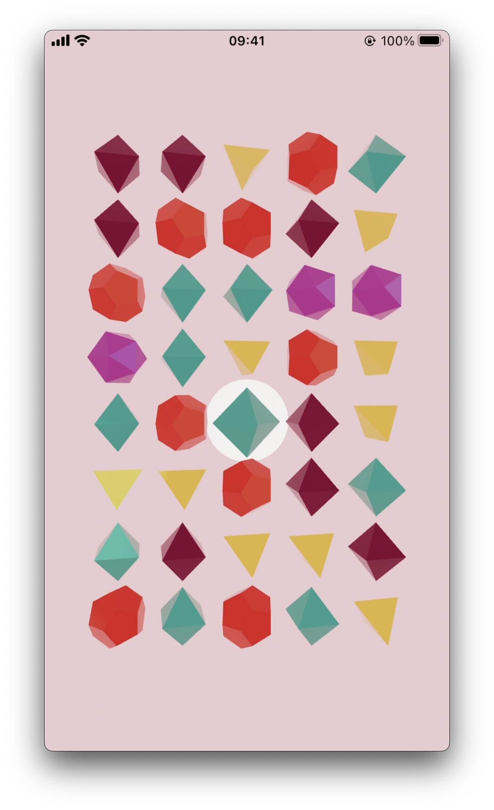

# 💎 Shiny stones mobile

Taking my original [shiny-stones](https://github.com/pepf/shiny-stones) for web as starting point, I've ported the game to react-native.

Like the original, it uses three.js and react-three-fiber under the hood. This allows me to render the gameplay elements in a declarative way.

## How to run
The codebase is generated from an expo template, and is still completely compatible with Expo go. More about [Expo Go](https://docs.expo.dev/get-started/expo-go/#install-expo-go-on-your-device).
> ⚠️ This project depends heavily on expo-gl and expo-three. openGL does not work well on iOS simulator, therefore it is best to use real devices when running the application.

## Todo
- Figure out smooth animations in react-native. I suspect react-spring might not work. Reanimated might work, but might be complicated because of the dynamic animations
- Scoring (incl combo bonusses)
- More gameplay elements, e.g. level with time limit, level with limited amount of moves or level where user needs to reach a certain score.
- Graphical improvements are done, uses dynamically generated environment maps to provide nice lightning. Improvements can be done by having some levels have different lightning or color schemes compared to others.